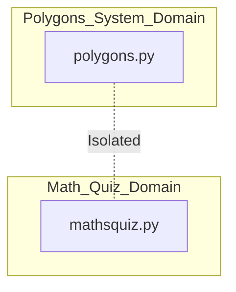
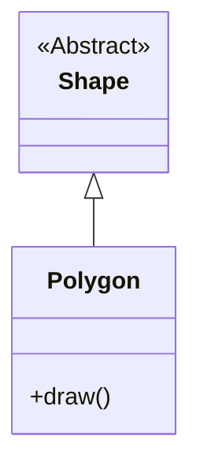

# Graph-Driven Sequential Debugging System

## Project Overview
This project addresses the challenges of debugging multi-component legacy systems using LLMs. Traditional "naive" agents often suffer from **Context Overflow** and the **"Lost in the Middle"** phenomenon when presented with unrelated codebases. 

This repository implements a **Sequential Orchestration Model** using **LangGraph**. By treating the codebase as a series of isolated "Communities" (Polygons and Math Quiz), we deploy specialized subagents that operate with clinical precision, resulting in high token efficiency and zero architectural cross-contamination.

## Rationale
*   **Target:** A legacy Python repository containing syntax errors, procedural "God Functions," and fragmented quiz logic.
*   **The Problem:** Reading the entire 200+ file repository (including unrelated math quiz steps) consumes excessive tokens and degrades the AI's reasoning capabilities.
*   **The Solution:** Use **Graphify** to map dependencies, then use a **Graph-Guided Agent** to surgically target and repair nodes one by one.

## Research Questions
1.  **Efficiency:** Can a graph-guided sequential approach achieve a >70% reduction in token usage compared to a monolithic read?
2.  **Accuracy:** Does mandatory context resetting between unrelated domains improve the quality of refactored OOP code?
3.  **Stability:** Can automated "Gatekeeper" nodes prevent regression in isolated code communities?

## Repository Structure
```text
C:\Users\diana\hw_4\
├── docs/               # PRD, PLAN, and ADR documentation
├── obsidian/           # Graphify products and navigation context (hot_*.md)
├── src/                # Refactored source code
│   ├── polygons/       # Isolated Polygons domain
│   └── mathsquiz/      # Isolated Math Quiz domain
├── tests/              # TDD-based unit tests (85% coverage target)
├── reports/            # Linter (Ruff) and Token Efficiency reports
└── main.py             # System entry point
```

## Agent Workflow & ADR
We utilize **LangGraph** for its deterministic state management. Unlike flexible agent swarms, LangGraph provides a "Gatekeeper" mechanism to purge context between phases.

### Workflow:
1.  **Router:** Initializes task from `index.md`.
2.  **Subagent Alpha:** Repairs the Polygons system.
3.  **Gatekeeper:** Performs **Context Compaction** (Memory Reset).
4.  **Subagent Beta:** Consolidates the Math Quiz system.

## Architectural Visualizations

### Domain Isolation


### OOP Refactoring Schema

