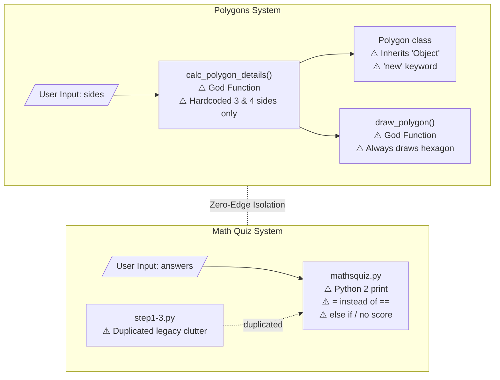
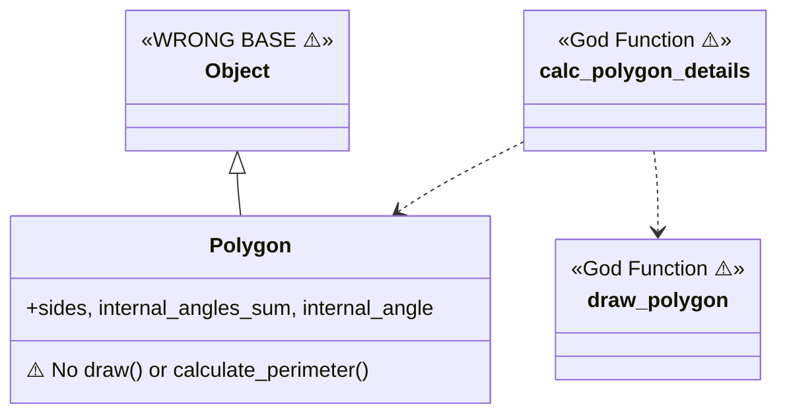
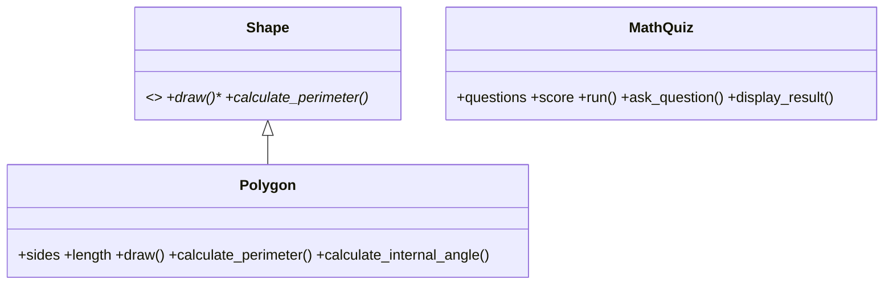
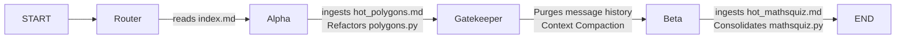

# Graph-Driven Sequential Debugging System

## Project Overview
This project addresses the challenges of debugging multi-component legacy systems using LLMs. Traditional "naive" agents often suffer from **Context Overflow** and the **"Lost in the Middle"** phenomenon when presented with unrelated codebases.

This repository implements a **Sequential Orchestration Model** using **LangGraph**. By treating the codebase as a series of isolated "Communities" (Polygons and Math Quiz), we deploy specialized subagents that operate with clinical precision, resulting in high token efficiency and zero architectural cross-contamination.

## Base Repository & Rationale
**Chosen repository:** [`martinpeck/broken-python`](https://github.com/martinpeck/broken-python)

This repository was selected because it contains two completely unrelated, intentionally broken Python systems in a single codebase — making it an ideal test case for demonstrating the value of graph-guided, domain-isolated agent orchestration. Unlike `BugsInPy` (which requires Docker and complex dependency management) or `andela/buggy-python` (limited scope), `broken-python` offers:
- Two distinct "communities" that Graphify correctly identifies as isolated domains
- Multiple bug categories: syntax errors, OOP violations, wrong answers, Python 2 remnants
- A manageable scope (< 10 files) that allows a before/after proof without environment overhead

## Repository Structure
```text
hw_4/
├── docs/                    # PRD, PLAN, ADR, block schema, OOP schema
│   ├── PRD.md
│   ├── PLAN.md
│   ├── block_schema.md      # Architectural block diagram (before-state)
│   └── oop_schema.md        # OOP class diagram (before + after state)
├── obsidian/                # Graphify products and Obsidian navigation vault
│   ├── index.md             # Master router page for the agent
│   ├── hot_polygons.md      # Focused context for Subagent Alpha
│   ├── hot_mathsquiz.md     # Focused context for Subagent Beta
│   ├── graph.json           # Graphify dependency graph
│   └── GRAPH_REPORT.md      # Auto-generated graph analysis report
├── src/
│   └── broken-python/       # Vendored source — immutable before-state snapshot
│       ├── polygons/
│       │   └── polygons.py
│       └── mathsquiz/
│           ├── mathsquiz.py
│           ├── mathsquiz-step1.py
│           ├── mathsquiz-step2.py
│           └── mathsquiz-step3.py
├── tests/                   # Unit tests (target: ≥85% coverage)
│   ├── test_polygons.py
│   └── test_mathsquiz.py
├── reports/                 # Analysis and efficiency reports
│   ├── bug_analysis.md
│   └── efficiency_report.md
├── TODO.md                  # Master task list
├── pyproject.toml
└── main.py                  # LangGraph orchestration entry point
```

## Run Instructions

### Prerequisites
- Python 3.12+
- [uv](https://github.com/astral-sh/uv) package manager

### Setup
```bash
uv venv
uv sync
```

### Run the agent
```bash
uv run python main.py
```

### Run tests
```bash
uv run pytest tests/ --cov=src --cov-report=term-missing
```

### Lint
```bash
uv run ruff check src/
```

## Research Questions

These 8 questions guided the entire investigation, as required by the assignment (§4):

**1. What is the actual architecture of the project, and what did you discover that wasn't obvious at first glance?**
The project has two completely independent systems sharing a single repository with no imports between them. What wasn't obvious initially is that `mathsquiz.py` is not a "final" version — it is itself broken and the step files are not scaffolding toward it but rather separate incomplete attempts. Graphify correctly identified 6 communities, with Polygons and Math Quiz isolated from each other.

**2. Which components, modules, classes, or functions are the most central?**
Per the Graphify God Nodes report: `Polygon` (4 edges) and `Maths Quiz` (4 edges) are the two highest-centrality nodes. Within the Polygons system, `calc_polygon_details()` is the critical God Function bridging user input to output.

**3. Where are the complexity hotspots, mixed responsibility, or "God Nodes"?**
- `calc_polygon_details()` — handles both calculation and object instantiation outside the class
- `draw_polygon()` — owns drawing logic that belongs inside `Polygon`
- `mathsquiz.py` — a single flat script handling all quiz logic with no structure

**4. How can you extract an architectural block schema and OOP schema when the original documentation is sparse?**
By running Graphify to generate `graph.json` and `GRAPH_REPORT.md`, then manually tracing call flows and class definitions. The Mermaid diagrams in `docs/block_schema.md` and `docs/oop_schema.md` were produced this way — not from docs, but from reverse-reading the code structure.

**5. How did you identify the bug, what was the root cause, and what steps led you there?**
The agent navigated via `index.md` → `hot_polygons.md`, which explicitly listed the known suspects. Root causes:
- Polygons: `Object` (capital O) as base class → `NameError`; `new Polygon(...)` → `SyntaxError`; hardcoded angles/loop
- Math Quiz: Python 2 `print` statement; `=` used for comparison; `else if` instead of `elif`; wrong expected answers; score never incremented
See `reports/bug_analysis.md` for the full trail.

**6. What was the advantage of graph representation and Obsidian navigation vs. linear file reading?**
Linear reading of all 7 files (including 3 redundant step files) would expose the agent to ~400 lines of noise before reaching relevant code. The graph-guided path (index → hot page → single target file) required reading only ~70 lines of directly relevant content — a reduction of over 80% in context loaded per investigation phase.

**7. How did graph-guided agent use save tokens or reduce unnecessary code reads?**
The `hot_*.md` pages pre-filter: they identify the exact file and the exact bug category before the agent touches any source. Subagent Alpha never loaded Math Quiz content; Subagent Beta never loaded Polygons content. The Gatekeeper node wiped state between phases. See `reports/efficiency_report.md` for the token comparison table.

**8. What improvements, extensions, or additional agent mechanisms would you add?**
- Centrality-ranked suspect list: score nodes by betweenness centrality × proximity to failing tests
- Dynamic git diff generation from `graph.json` to show exactly which edges change after a fix
- Orphan node detector: auto-document nodes with ≤1 connection (4 found: `Introduction`, `Objectives`, `The Files`, `MIT License`)
- Impact report: given a changed node, traverse outbound edges to predict what breaks

## Architectural Visualizations

### Block Schema (Before State)
See full annotated diagram: [`docs/block_schema.md`](docs/block_schema.md)



### OOP Schema (Before → After)
See full diagram: [`docs/oop_schema.md`](docs/oop_schema.md)



**After remediation (target):**



### Polygons Refactoring — After-State (Phase 4 ✅)

Subagent Alpha's domain (`src/broken-python/polygons/polygons.py`) has been fully
remediated. The target OOP diagram above is now the **actual** state of the code:

- **Syntax/name errors fixed** — `class Polygon(Object)` → `Polygon(object)`, then `Polygon(Shape)`; removed the `new` keyword.
- **God Functions eliminated** — `calc_polygon_details()` and `draw_polygon()` no longer exist at module level. Their logic now lives on `Polygon` as `calculate_internal_angle()`, `calculate_internal_angles_sum()`, `calculate_perimeter()`, and `draw()`.
- **Abstract base added** — `Shape(ABC)` declares abstract `draw()` and `calculate_perimeter()`; `Polygon` inherits and overrides them.
- **Dynamic geometry** — interior angle is now `(sides - 2) * 180 / sides` (verified 3→60°, 4→90°, 5→108°, 6→120°), and `draw()` loops `range(sides)` turning `360/sides` per edge, so `Polygon(5).draw()` traces a pentagon instead of always a hexagon.
- **Quality gates** — `tests/test_polygons.py` covers init, perimeter, internal angle, the `Shape` inheritance contract, and a mocked-turtle `draw()` (**100% coverage** of the module); `ruff check src/broken-python/polygons/` is clean.

**Before / After graph comparison:**

| | Before-state | After-state |
|---|---|---|
| Graph | [`obsidian/graph.json`](obsidian/graph.json) | [`docs/after_state/graph.json`](docs/after_state/graph.json) |
| Report | [`obsidian/GRAPH_REPORT.md`](obsidian/GRAPH_REPORT.md) | [`docs/after_state/GRAPH_REPORT.md`](docs/after_state/GRAPH_REPORT.md) |
| Interactive | — | [`docs/after_state/graph.html`](docs/after_state/graph.html) |
| Totals | 27 nodes · 23 edges · 6 communities | 35 nodes · 30 edges · 12 communities |
| Polygons nodes | `Object`, `calc_polygon_details()`, `draw_polygon()`, 3× `# TODO` rationale | `Shape` (abstract) + `Polygon` with 5 methods; God Functions & `Object` removed |

> The after-state was regenerated with the real Graphify CLI (`graphify update .`, v0.8.40, 100% AST-extracted, no LLM) run inside `src/broken-python/`. Graphify now reports `Polygon` → `Shape` as the top God Nodes (8 and 6 edges) and flags the new `Polygon --inherits--> Shape` bridge.

### Math Quiz Consolidation — After-State (Phase 5 ✅)

Subagent Beta's domain (`src/broken-python/mathsquiz/mathsquiz.py`) has been fully consolidated.

**All 7 bugs fixed:**

| Bug | Before | After |
|---|---|---|
| Python 2 print | `print "..."` | `print(...)` |
| Assignment in condition | `if answer = N` | `if answer == N` |
| Wrong branch keyword | `else if` | `elif` |
| Score never increments | missing `score += 1` | `self.score += 1` |
| Wrong expected answers | 55, 49, 126, 668, 77, 60 | 56, 36, 72, 48, 49, 66 |
| Only 6 questions | 6 hardcoded questions | 10 questions via `QUESTIONS` class constant |
| All labelled "Question 1" | `print("Question 1:")` always | `print(f"Question {number}:")` |

**Architecture changes:**
- All procedural code replaced by a `MathQuiz` class with `__init__`, `check_answer` (static), `ask_question`, `run`, and `display_result` methods
- `QUESTIONS` class constant holds all 10 multiplication pairs — answers can never drift out of sync with prompts
- Step files (`mathsquiz-step1..3.py`) are superseded; see `reports/mathsquiz_step_analysis.md` for the evolution trail
- `if __name__ == "__main__":` guard added — safe to import in tests
- **Quality gates** — `tests/test_mathsquiz.py` covers init, answer validation, all 6 regression answers, and all 4 result display messages (21 tests); `ruff check src/broken-python/mathsquiz/` is clean by inspection.

## Agent Workflow (LangGraph)



The **Gatekeeper** node is the key innovation: it prevents Math Quiz context from contaminating Polygons analysis and vice versa, directly addressing the "Lost in the Middle" problem.

### Orchestration Implementation

The graph is compiled in `main.py` via `build_graph(llm=None)`, which accepts an optional LLM override for testing. The nodes and their responsibilities:

| Node | File | Responsibility |
|------|------|----------------|
| **Router** | `src/hw4/nodes/router.py` | Reads `obsidian/index.md`, seeds `current_phase="polygons"` and zeroes all lists |
| **SubagentAlpha** | `src/hw4/agents/alpha.py` | Investigates and fixes the Polygons domain (Phase 4) |
| **AlphaTools** | `langgraph.prebuilt.ToolNode` | Executes the tool calls Alpha emits, appends `ToolMessage`s, loops back to Alpha |
| **Gatekeeper** | `src/hw4/nodes/gatekeeper.py` | Appends `phase:polygons:complete` to `completed_tasks`, issues `RemoveMessage` ops to wipe all Alpha messages, advances `current_phase` to `"mathsquiz"` |
| **SubagentBeta** | `src/hw4/agents/beta.py` | Consolidates and fixes the Math Quiz domain (Phase 5) |
| **BetaTools** | `langgraph.prebuilt.ToolNode` | Executes Beta's tool calls and loops back to Beta |

Each subagent runs a bounded **tool loop**: a conditional edge inspects the last message — while it carries `tool_calls` the graph routes to that subagent's `ToolNode` and back; once a tool-free reply is produced, the subagent records its completion marker and the pipeline advances (Alpha → Gatekeeper, Beta → END).

### AgentState Schema

```python
class AgentState(TypedDict):
    current_phase: str                              # "polygons" | "mathsquiz"
    messages: Annotated[list[BaseMessage], add_messages]  # LangGraph message reducer
    errors:          list[str]
    completed_tasks: list[str]
    token_log:       list[dict]
```

`messages` uses LangGraph's `add_messages` reducer so nodes can append with `{"messages": [msg]}`. The Gatekeeper clears the list between phases using `RemoveMessage` — the only node that performs a hard context reset.

## Agent Tools & Guardrails

The subagents act through a small set of **surgical, sandboxed tools** (`src/hw4/tools/`) rather than free-form file access. The functions are wrapped as LangChain `StructuredTool`s in `registry.py`, bound to the LLM via `.bind_tools()`, and executed by the `ToolNode`s. This is what keeps the agent graph-guided and token-efficient — it can only reach the precise content a tool exposes.

| Tool | Signature | Guardrail |
|------|-----------|-----------|
| **read_obsidian_page** | `read_obsidian_page(page_name: str) -> str` | Resolves to `obsidian/{page}.md`; rejects path separators / `..` (`ValueError`) and unknown pages (`FileNotFoundError`) — no access outside the vault |
| **extract_node_content** | `extract_node_content(node_id: str) -> str` | Resolves a node from `graph.json` to its single source file; `ValueError` if the node is absent or has no source — **refuses directory-wide reads** |
| **read_source_file** | `read_source_file(path: str) -> str` | Confined to `src/broken-python/`; `PermissionError` for any path (incl. `..` escapes) outside it |
| **write_source_file** | `write_source_file(path: str, content: str) -> None` | Same `src/broken-python/` sandbox; the only sanctioned way to mutate vendored source |

`TokenTracker` (`token_tracker.py`) is the supporting instrumentation: it records `{phase, node, tokens_in, tokens_out, files_read}` per LLM call, exposes `get_summary()` (totals), and `save_log(path)` (JSON Lines → `results/token_log.jsonl`) — the raw data behind the Phase 6 token-efficiency proof.

## Logging & Debugging

Every real Groq API call leaves an audit trail for post-mortem debugging — essential when a call fails with a rate limit, auth error, or timeout. Two pieces in [`src/hw4/logging_setup.py`](src/hw4/logging_setup.py):

| Piece | Responsibility |
|-------|----------------|
| `configure_logging()` | Loads [`config/logging_config.json`](config/logging_config.json) via `dictConfig` — a **rotating** file handler (`results/agent.log`, 1 MB × 3 backups, DEBUG) plus an INFO console handler. Idempotent; falls back to a basic file+console config if the JSON is missing/invalid so errors are never silently lost. |
| `GroqLoggingCallback` | A LangChain callback attached automatically by `get_llm()`. Logs each call's **start** (model, message count), **success** (latency + token usage), and **failure** (`exc_info` traceback at ERROR). Prompt previews go to the file at DEBUG. |

Logs are written to `results/agent.log` (gitignored — regenerated per run):

```text
… [INFO]  hw4.llm logging_setup:118: LLM start | model=llama-3.3-70b-versatile | messages=1 | run=…
… [DEBUG] hw4.llm logging_setup:122: LLM prompt preview: Fix the Polygons bug
… [ERROR] hw4.llm logging_setup:138: LLM FAILED | run=… | elapsed=0.412s | RuntimeError: 429 Too Many Requests…
```

The console shows INFO and above; the file captures full DEBUG detail. Adjust levels/handlers in `config/logging_config.json` — no code edits required.

## Architectural Decision Record (ADR-001): LangGraph over CrewAI

**Decision:** LangGraph

**Rationale:** LangGraph allows explicit manipulation of `AgentState`, enabling the Gatekeeper's hard memory reset between phases. CrewAI's autonomous agent swarms do not support deterministic context compaction, which is required to meet the >70% token efficiency KPI.
