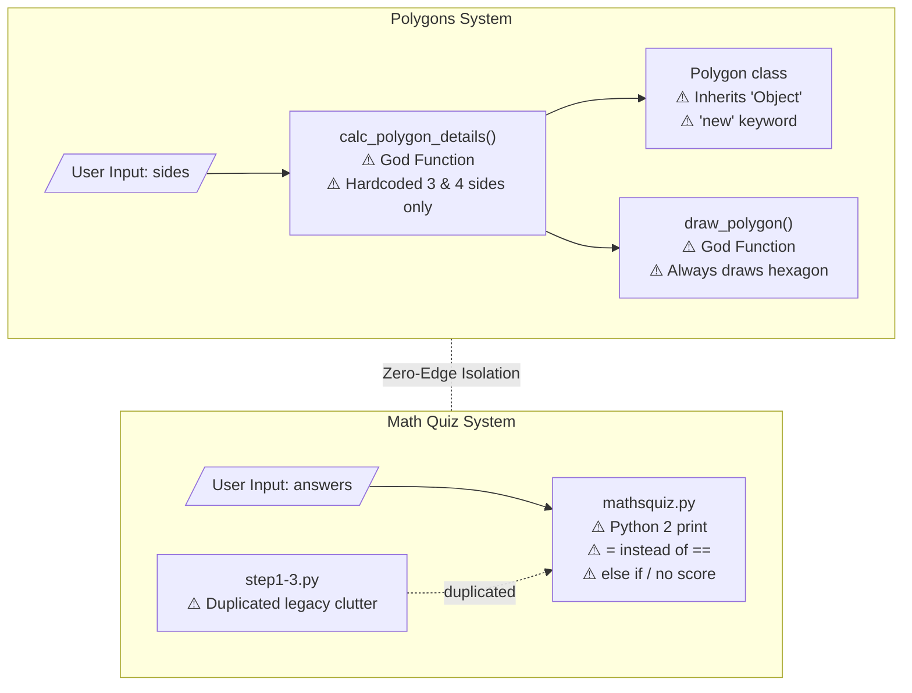
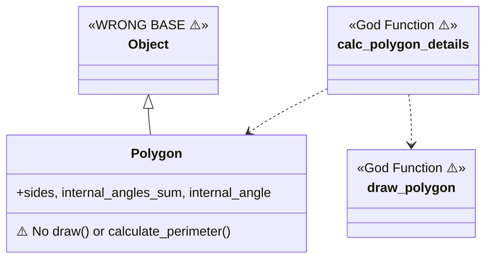
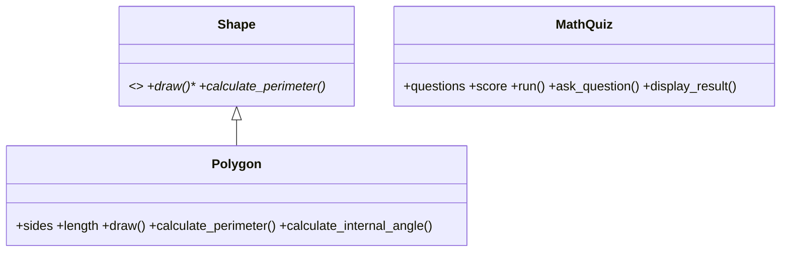
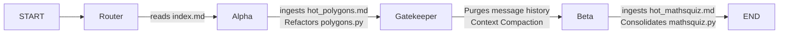

# Graph-Driven Sequential Debugging System

## Project Overview
This project addresses the challenges of debugging multi-component legacy systems using LLMs. Traditional "naive" agents often suffer from **Context Overflow** and the **"Lost in the Middle"** phenomenon when presented with unrelated codebases.

This repository implements a **Sequential Orchestration Model** using **LangGraph**. By treating the codebase as a series of isolated "Communities" (Polygons and Math Quiz), we deploy specialized subagents that operate with clinical precision, resulting in high token efficiency and zero architectural cross-contamination.

## Base Repository & Rationale
**Chosen repository:** [`martinpeck/broken-python`](https://github.com/martinpeck/broken-python)

This repository was selected because it contains two completely unrelated, intentionally broken Python systems in a single codebase — making it an ideal test case for demonstrating the value of graph-guided, domain-isolated agent orchestration. Unlike `BugsInPy` (which requires Docker and complex dependency management) or `andela/buggy-python` (limited scope), `broken-python` offers:
- Two distinct "communities" that Graphify correctly identifies as isolated domains
- Multiple bug categories: syntax errors, OOP violations, wrong answers, Python 2 remnants
- A manageable scope (< 10 files) that allows a before/after proof without environment overhead

## Repository Structure
```text
hw_4/
├── docs/                    # PRD, PLAN, ADR, block schema, OOP schema
│   ├── PRD.md
│   ├── PLAN.md
│   ├── block_schema.md      # Architectural block diagram (before-state)
│   └── oop_schema.md        # OOP class diagram (before + after state)
├── obsidian/                # Graphify products and Obsidian navigation vault
│   ├── index.md             # Master router page for the agent
│   ├── hot_polygons.md      # Focused context for Subagent Alpha
│   ├── hot_mathsquiz.md     # Focused context for Subagent Beta
│   ├── graph.json           # Graphify dependency graph
│   └── GRAPH_REPORT.md      # Auto-generated graph analysis report
├── src/
│   └── broken-python/       # Vendored source — immutable before-state snapshot
│       ├── polygons/
│       │   └── polygons.py
│       └── mathsquiz/
│           ├── mathsquiz.py
│           ├── mathsquiz-step1.py
│           ├── mathsquiz-step2.py
│           └── mathsquiz-step3.py
├── tests/                   # Unit tests (target: ≥85% coverage)
│   ├── test_polygons.py
│   └── test_mathsquiz.py
├── reports/                 # Analysis and efficiency reports
│   ├── bug_analysis.md
│   └── efficiency_report.md
├── TODO.md                  # Master task list
├── pyproject.toml
└── main.py                  # LangGraph orchestration entry point
```

## Run Instructions

### Prerequisites
- Python 3.12+
- [uv](https://github.com/astral-sh/uv) package manager

### Setup
```bash
uv venv
uv sync
```

### Run the agent
```bash
uv run python main.py
```

### Run tests
```bash
uv run pytest tests/ --cov=src --cov-report=term-missing
```

### Lint
```bash
uv run ruff check src/
```

## Research Questions

These 8 questions guided the entire investigation, as required by the assignment (§4):

**1. What is the actual architecture of the project, and what did you discover that wasn't obvious at first glance?**
The project has two completely independent systems sharing a single repository with no imports between them. What wasn't obvious initially is that `mathsquiz.py` is not a "final" version — it is itself broken and the step files are not scaffolding toward it but rather separate incomplete attempts. Graphify correctly identified 6 communities, with Polygons and Math Quiz isolated from each other.

**2. Which components, modules, classes, or functions are the most central?**
Per the Graphify God Nodes report: `Polygon` (4 edges) and `Maths Quiz` (4 edges) are the two highest-centrality nodes. Within the Polygons system, `calc_polygon_details()` is the critical God Function bridging user input to output.

**3. Where are the complexity hotspots, mixed responsibility, or "God Nodes"?**
- `calc_polygon_details()` — handles both calculation and object instantiation outside the class
- `draw_polygon()` — owns drawing logic that belongs inside `Polygon`
- `mathsquiz.py` — a single flat script handling all quiz logic with no structure

**4. How can you extract an architectural block schema and OOP schema when the original documentation is sparse?**
By running Graphify to generate `graph.json` and `GRAPH_REPORT.md`, then manually tracing call flows and class definitions. The Mermaid diagrams in `docs/block_schema.md` and `docs/oop_schema.md` were produced this way — not from docs, but from reverse-reading the code structure.

**5. How did you identify the bug, what was the root cause, and what steps led you there?**
The agent navigated via `index.md` → `hot_polygons.md`, which explicitly listed the known suspects. Root causes:
- Polygons: `Object` (capital O) as base class → `NameError`; `new Polygon(...)` → `SyntaxError`; hardcoded angles/loop
- Math Quiz: Python 2 `print` statement; `=` used for comparison; `else if` instead of `elif`; wrong expected answers; score never incremented
See `reports/bug_analysis.md` for the full trail.

**6. What was the advantage of graph representation and Obsidian navigation vs. linear file reading?**
Linear reading of all 7 files (including 3 redundant step files) would expose the agent to ~400 lines of noise before reaching relevant code. The graph-guided path (index → hot page → single target file) required reading only ~70 lines of directly relevant content — a reduction of over 80% in context loaded per investigation phase.

**7. How did graph-guided agent use save tokens or reduce unnecessary code reads?**
The `hot_*.md` pages pre-filter: they identify the exact file and the exact bug category before the agent touches any source. Subagent Alpha never loaded Math Quiz content; Subagent Beta never loaded Polygons content. The Gatekeeper node wiped state between phases. See `reports/efficiency_report.md` for the token comparison table.

**8. What improvements, extensions, or additional agent mechanisms would you add?**
- Centrality-ranked suspect list: score nodes by betweenness centrality × proximity to failing tests
- Dynamic git diff generation from `graph.json` to show exactly which edges change after a fix
- Orphan node detector: auto-document nodes with ≤1 connection (4 found: `Introduction`, `Objectives`, `The Files`, `MIT License`)
- Impact report: given a changed node, traverse outbound edges to predict what breaks

## Architectural Visualizations

### Block Schema (Before State)
See full annotated diagram: [`docs/block_schema.md`](docs/block_schema.md)



### OOP Schema (Before → After)
See full diagram: [`docs/oop_schema.md`](docs/oop_schema.md)



**After remediation (target):**



## Agent Workflow (LangGraph)



The **Gatekeeper** node is the key innovation: it prevents Math Quiz context from contaminating Polygons analysis and vice versa, directly addressing the "Lost in the Middle" problem.

## Architectural Decision Record (ADR-001): LangGraph over CrewAI

**Decision:** LangGraph

**Rationale:** LangGraph allows explicit manipulation of `AgentState`, enabling the Gatekeeper's hard memory reset between phases. CrewAI's autonomous agent swarms do not support deterministic context compaction, which is required to meet the >70% token efficiency KPI.
