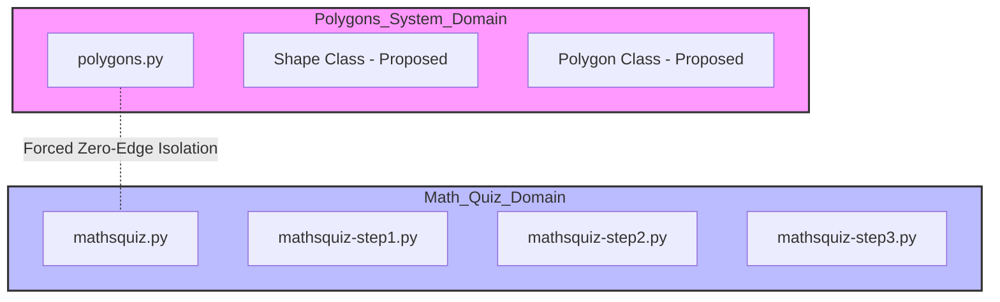
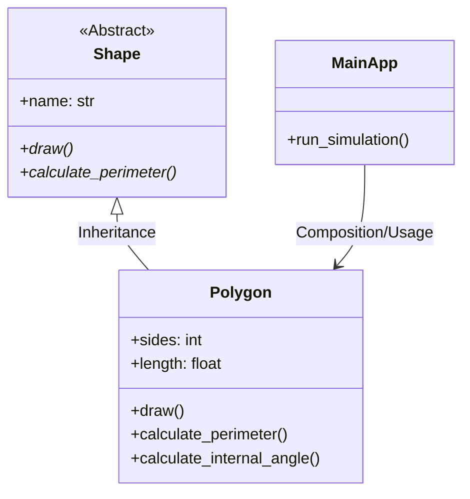

# Sequential Debugging Orchestration Plan: LangGraph & Context Engineering

## 1. Project Goals
The primary objective is to execute a full-system repair of the **Broken Python** repository while maintaining strict token efficiency. By utilizing a sequential, graph-driven approach, we isolate the contexts of the **Polygons System** and the **Math Quiz System**, eliminating the "Lost in the Middle" problem.

## 2. Architectural Visualizations (Reverse Engineering)

### System Domain Isolation (Zero Edge Protocol)
This diagram illustrates the separation of the two unrelated communities as identified in the dependency graph. 

**Note on Graph Centrality:** While the Graph Report identifies high-centrality nodes (e.g., `Maths Quiz` or shared entry points) that may bridge communities, this orchestration engine enforces an artificial **"Zero Edge" isolation protocol**. During remediation, subagents are strictly prohibited from traversing these bridge edges, ensuring that context from one domain never contaminates the other.



### Refactored OOP Schema (Target Architecture)
The refactored Polygons system transitions from procedural logic to a clean inheritance-based structure.



## 3. Architectural Decision Records (ADR)

### ADR 001: Choice of Orchestration Framework
*   **Decision:** Use **LangGraph** instead of CrewAI or AutoGen.
*   **Context:** The project requires deterministic control over the state and context window to meet the >70% token efficiency KPI.
*   **Rationale:** 
    *   **Surgical State Control:** LangGraph allows for explicit manipulation of the `AgentState`, enabling the implementation of "Gatekeeper" nodes.
    *   **Context Compaction:** Unlike autonomous agent swarms (CrewAI), LangGraph nodes can be programmed to perform a hard reset of the message history between phases.
    *   **Mitigating "Lost in the Middle":** By clearing the context window before transitioning from Polygons to Math Quiz, we ensure the LLM focus remains 100% on the current task.

## 4. Recommended Repository Structure
```text
C:\Users\diana\hw_4\
├── config/                      # All runtime configuration — no hardcoded values in code
│   ├── setup.json               # LLM provider, model, agent settings, paths
│   ├── rate_limits.json         # API rate limits and retry config per provider
│   └── logging_config.json      # Python logging configuration
├── docs/                        # PRD, PLAN, ADR, schemas, and per-mechanism PRDs
│   ├── PRD.md                   # Project-level PRD
│   ├── PRD_langgraph_orchestration.md  # PRD for the StateGraph engine
│   ├── PRD_gatekeeper.md        # PRD for the context-purge Gatekeeper node
│   ├── PRD_token_tracker.md     # PRD for token logging infrastructure
│   ├── PRD_node_extractor.md    # PRD for the surgical graph-node reader tool
│   ├── PRD_orphan_detector.md   # PRD for the Phase 7 Orphan Node Detector extension
│   ├── PLAN.md
│   ├── TODO.md                  # Canonical task list
│   ├── block_schema.md          # Architectural block diagram (before-state)
│   ├── oop_schema.md            # OOP class diagrams (before + after state)
│   ├── prompts_log.md           # Prompts Engineering Log (§8.3 requirement)
│   └── before_state/            # Graphify snapshot prior to agent run
│       ├── graph.json
│       └── GRAPH_REPORT.md
├── obsidian/                    # Graphify products and Obsidian navigation vault
│   ├── index.md                 # Master router page for the agent
│   ├── hot_polygons.md          # Focused context for Subagent Alpha
│   ├── hot_mathsquiz.md         # Focused context for Subagent Beta
│   ├── _COMMUNITY_Community 0.md
│   ├── graph.json               # Graphify dependency graph
│   └── GRAPH_REPORT.md          # Auto-generated graph analysis report
├── src/
│   ├── hw4/                     # Main Python package
│   │   ├── __init__.py          # __version__, __author__, __all__
│   │   ├── constants.py         # Project-wide constants (no magic strings/numbers in code)
│   │   ├── shared/
│   │   │   ├── __init__.py
│   │   │   └── version.py       # VERSION = "1.00" — single source of truth
│   │   ├── sdk/
│   │   │   └── __init__.py      # Public SDK layer — all business logic exposed here
│   │   ├── nodes/               # LangGraph node implementations
│   │   │   ├── __init__.py
│   │   │   ├── router.py        # Master Router node
│   │   │   └── gatekeeper.py    # Gatekeeper node (context purge)
│   │   ├── tools/               # LangGraph tool implementations
│   │   │   ├── __init__.py
│   │   │   ├── obsidian_reader.py
│   │   │   ├── node_extractor.py
│   │   │   ├── file_io.py
│   │   │   └── token_tracker.py
│   │   ├── agents/              # Subagent system prompts
│   │   │   ├── __init__.py
│   │   │   ├── alpha_prompt.py  # Subagent Alpha (Polygons) domain prompt
│   │   │   └── beta_prompt.py   # Subagent Beta (Math Quiz) domain prompt
│   │   └── extensions/          # Phase 7 original extensions
│   │       ├── __init__.py
│   │       └── orphan_detector.py
│   └── broken-python/           # Vendored source — immutable before-state snapshot
│       ├── polygons/
│       │   └── polygons.py
│       └── mathsquiz/
│           ├── mathsquiz.py
│           ├── mathsquiz-step1.py
│           ├── mathsquiz-step2.py
│           └── mathsquiz-step3.py
├── tests/                       # TDD-based unit tests (target: ≥85% coverage)
│   ├── __init__.py
│   ├── test_polygons.py
│   ├── test_mathsquiz.py
│   ├── test_graph.py            # Smoke test for LangGraph topology (Phase 2)
│   └── test_tools.py            # Unit tests for all agent tools (Phase 3)
├── reports/                     # Bug analysis and token efficiency reports
│   ├── bug_analysis.md
│   └── efficiency_report.md
├── results/                     # Agent run outputs (logs, token data, orphan report)
│   └── .gitkeep
├── notebooks/                   # Research and analysis notebooks
│   └── .gitkeep
├── assets/                      # Screenshots and visual assets
│   └── obsidian_vault_before.png
├── .env-example                 # Secret placeholder template (never commit .env)
├── .gitignore
├── TODO.md                      # Master task list (canonical)
├── pyproject.toml
├── uv.lock
└── main.py                      # LangGraph orchestration entry point
```

## 5. Agent Workflow Implementation
1.  **Master Router:** Reads `index.md` and initializes the `AgentState`.
2.  **Subagent Alpha (Polygons):** Ingests `hot_polygons.md`, refactors code, and updates the local graph.
3.  **The Gatekeeper:** Intercepts the state, logs completion, and **purges the message history**.
4.  **Subagent Beta (Math Quiz):** Ingests `hot_mathsquiz.md` with a clean context and consolidates the quiz engine.
