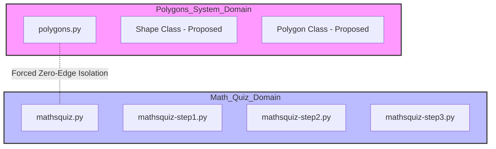
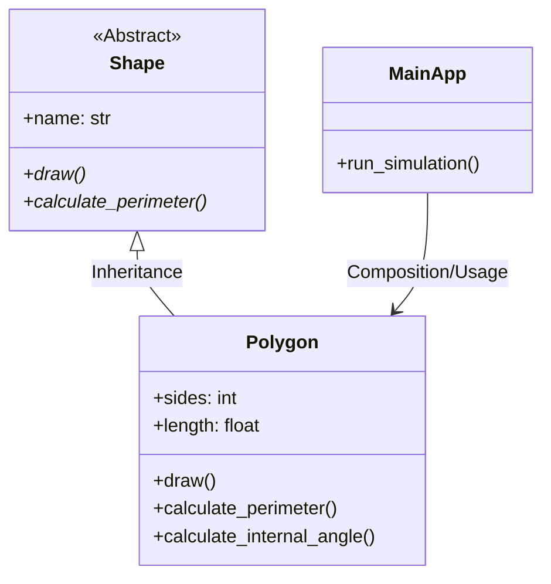

# Sequential Debugging Orchestration Plan: LangGraph & Context Engineering

## 1. Project Goals
The primary objective is to execute a full-system repair of the **Broken Python** repository while maintaining strict token efficiency. By utilizing a sequential, graph-driven approach, we isolate the contexts of the **Polygons System** and the **Math Quiz System**, eliminating the "Lost in the Middle" problem.

## 2. Architectural Visualizations (Reverse Engineering)

### System Domain Isolation (Zero Edge Protocol)
This diagram illustrates the separation of the two unrelated communities as identified in the dependency graph. 

**Note on Graph Centrality:** While the Graph Report identifies high-centrality nodes (e.g., `Maths Quiz` or shared entry points) that may bridge communities, this orchestration engine enforces an artificial **"Zero Edge" isolation protocol**. During remediation, subagents are strictly prohibited from traversing these bridge edges, ensuring that context from one domain never contaminates the other.



### Refactored OOP Schema (Target Architecture)
The refactored Polygons system transitions from procedural logic to a clean inheritance-based structure.



## 3. Architectural Decision Records (ADR)

### ADR 001: Choice of Orchestration Framework
*   **Decision:** Use **LangGraph** instead of CrewAI or AutoGen.
*   **Context:** The project requires deterministic control over the state and context window to meet the >70% token efficiency KPI.
*   **Rationale:** 
    *   **Surgical State Control:** LangGraph allows for explicit manipulation of the `AgentState`, enabling the implementation of "Gatekeeper" nodes.
    *   **Context Compaction:** Unlike autonomous agent swarms (CrewAI), LangGraph nodes can be programmed to perform a hard reset of the message history between phases.
    *   **Mitigating "Lost in the Middle":** By clearing the context window before transitioning from Polygons to Math Quiz, we ensure the LLM focus remains 100% on the current task.

### ADR 002: Central API Gatekeeper for All External Calls
*   **Decision:** Route every external LLM call through a single `ApiGatekeeper` (`src/hw4/gateway/`) instead of calling the provider SDK directly. See [`PRD_api_gatekeeper.md`](PRD_api_gatekeeper.md).
*   **Context:** §5 mandates that all API calls pass a central gatekeeper that enforces rate limits, queues overflow, retries, and logs — and free-tier Groq has hard RPM/TPM ceilings that crash a run when exceeded.
*   **Rationale:**
    *   **Sliding-window-log** rate limiting (vs. fixed-window/token-bucket) is exact with no boundary bursting; memory cost is trivial at our call volume.
    *   **Bounded FIFO overflow queue** preserves arrival order and raises a backpressure alert when full, rather than rejecting or growing unbounded.
    *   **Proxy at `get_llm()`** (`GatekeptChatModel`) wraps only the real model, so injected test fakes bypass the gatekeeper and the suite stays offline/fast, while every production call is mediated.
    *   **Retry transient-only** (429/503/timeout) keeps `tool_use_failed` (400) flowing straight to the repair shim.

### ADR 003: SDK Layer as the Sole Entry Point
*   **Decision:** Expose all business operations through one facade, `GraphifySDK` (`src/hw4/sdk/`); CLI scripts (`main.py`, `run_live_agent.py`) are thin controllers that delegate to it.
*   **Context:** §4.1 requires every business function to be reachable via an SDK class, with no business logic living in CLI/GUI/controller layers.
*   **Rationale:**
    *   **Single import surface:** external consumers `from hw4.sdk import GraphifySDK` and run graph builds, repair runs, efficiency comparisons, and orphan analysis without reaching into internal modules.
    *   **Logic relocated:** graph assembly moved to `hw4.graph`; the stream-and-collect run loop moved to `hw4.sdk.repair` — leaving the entry-point scripts at ~10–65 lines.
    *   **Testability:** `run_repair` accepts an injected LLM, so the full pipeline is exercised deterministically with fakes.

## 4. Repository Structure (current state)
```text
Project-4/
├── config/                      # All runtime configuration — no hardcoded values in code
│   ├── setup.json               # LLM provider, model, agent settings, paths (gitignored)
│   ├── setup.example.json       # Committed default config (copy to setup.json)
│   ├── rate_limits.json         # API rate limits, retry & queue config per provider (§5)
│   └── logging_config.json      # Python logging configuration
├── docs/                        # PRD, PLAN, ADR, schemas, and per-mechanism PRDs
│   ├── PRD.md                   # Project-level PRD
│   ├── PLAN.md                  # This file
│   ├── TODO.md                  # Canonical task list
│   ├── PRD_langgraph_orchestration.md  # PRD for the StateGraph engine
│   ├── PRD_gatekeeper.md        # PRD for the context-purge Gatekeeper *node*
│   ├── PRD_api_gatekeeper.md    # PRD for the central *API* gatekeeper & rate limiting (§5)
│   ├── PRD_token_tracker.md     # PRD for token logging infrastructure
│   ├── PRD_node_extractor.md    # PRD for the surgical graph-node reader tool
│   ├── PRD_orphan_detector.md   # PRD for the Phase 7 Orphan Node Detector extension
│   ├── block_schema.md          # Architectural block diagram (before-state)
│   ├── oop_schema.md            # OOP class diagrams (before + after state)
│   ├── prompts_log.md           # Prompts Engineering Log (§8.3 requirement)
│   ├── before_state/            # Graphify snapshot prior to agent run
│   └── after_state/             # Graphify snapshot after the Polygons refactor
├── obsidian/                    # Graphify products and Obsidian navigation vault
│   ├── index.md                 # Master router page for the agent
│   ├── hot_polygons.md          # Focused context for Subagent Alpha
│   ├── hot_mathsquiz.md         # Focused context for Subagent Beta
│   ├── knowledge_delta.md       # Before/after knowledge-graph diff
│   ├── _COMMUNITY_Community 0.md
│   ├── graph.json               # Graphify dependency graph
│   └── GRAPH_REPORT.md          # Auto-generated graph analysis report
├── src/
│   ├── hw4/                     # Main Python package (every file ≤ 150 LOC)
│   │   ├── __init__.py          # __version__, __author__, __all__
│   │   ├── constants.py         # Project-wide constants (no magic strings/numbers in code)
│   │   ├── state.py             # AgentState TypedDict (add_messages reducer)
│   │   ├── graph.py             # build_graph() — compiles the StateGraph (Phase 2)
│   │   ├── llm_config.py        # get_llm() — config-driven, wrapped by the API gatekeeper
│   │   ├── logging_setup.py     # Central logging + GroqLoggingCallback audit trail
│   │   ├── baseline_agent.py    # Naive whole-repo baseline (efficiency control)
│   │   ├── efficiency.py        # Deterministic baseline-vs-guided token comparison
│   │   ├── live_efficiency.py   # Real-Groq token measurement
│   │   ├── shared/              # version.py = "1.00" (single source of truth)
│   │   ├── sdk/                 # PUBLIC SDK LAYER (§4.1) — sole entry point
│   │   │   ├── __init__.py      # Exports GraphifySDK, RepairResult, __version__
│   │   │   ├── core.py          # GraphifySDK facade over every business operation
│   │   │   └── repair.py        # run_repair() + RepairResult (graph stream/collect)
│   │   ├── gateway/             # CENTRAL API GATEKEEPER (§5) — all calls pass through here
│   │   │   ├── __init__.py
│   │   │   ├── config.py        # RateLimitConfig loaded from config/rate_limits.json
│   │   │   ├── rate_limiter.py  # SlidingWindowRateLimiter (RPM + TPM)
│   │   │   ├── overflow_queue.py# Bounded FIFO queue + backpressure alert
│   │   │   ├── gatekeeper.py    # ApiGatekeeper — admit → drain → retry → log
│   │   │   └── llm_proxy.py     # GatekeptChatModel — routes a model's calls through it
│   │   ├── nodes/               # LangGraph node implementations
│   │   │   ├── router.py        # Master Router node
│   │   │   └── gatekeeper.py    # Gatekeeper node (context purge) — NOT the API gatekeeper
│   │   ├── tools/               # LangGraph tool implementations
│   │   │   ├── obsidian_reader.py · node_extractor.py · file_io.py
│   │   │   ├── token_tracker.py · registry.py
│   │   │   └── tool_call_repair.py  # Repairs Groq tool_use_failed payloads
│   │   ├── agents/              # Subagent nodes + system prompts
│   │   │   ├── alpha.py · alpha_prompt.py  (Polygons)
│   │   │   └── beta.py  · beta_prompt.py   (Math Quiz)
│   │   └── extensions/          # Phase 7 original extension
│   │       └── orphan_detector.py
│   └── broken-python/           # Vendored source under repair (polygons/ + mathsquiz/)
├── tests/                       # TDD unit tests — 182 tests, ≥85% coverage (currently 91%)
│   ├── test_polygons.py · test_mathsquiz.py
│   ├── test_graph.py · test_tools.py · test_tool_call_repair.py
│   ├── test_llm_config.py · test_logging_setup.py · test_baseline_agent.py · test_efficiency.py
│   ├── test_orphan_detector.py
│   ├── test_gateway_config.py · test_gateway_rate_limiter.py · test_gateway_queue.py
│   ├── test_gateway_gatekeeper.py · test_gateway_proxy.py   # API gatekeeper (§5)
│   └── test_sdk.py                                          # SDK facade (§4.1)
├── reports/                     # Bug analysis and token efficiency reports
├── results/                     # Agent run outputs (logs, token data, orphan report)
├── notebooks/                   # Research and analysis notebooks
├── assets/                      # Screenshots and visual assets
├── .env-example                 # Secret placeholder template (never commit .env)
├── .gitignore · pyproject.toml · uv.lock
├── main.py                      # Thin CLI — delegates to GraphifySDK (prints graph diagram)
└── run_live_agent.py            # Thin CLI — delegates to GraphifySDK.run_repair (live Groq)
```

## 5. Agent Workflow Implementation
Consumers drive the pipeline through the SDK — `GraphifySDK().run_repair()` builds the graph and streams it; `main.py`/`run_live_agent.py` are thin delegating controllers. Every LLM call inside the run is mediated by the API gatekeeper (ADR 002).

1.  **Master Router:** Reads `index.md` and initializes the `AgentState`.
2.  **Subagent Alpha (Polygons):** Ingests `hot_polygons.md`, refactors code, and updates the local graph.
3.  **The Gatekeeper (node):** Intercepts the state, logs completion, and **purges the message history**.
4.  **Subagent Beta (Math Quiz):** Ingests `hot_mathsquiz.md` with a clean context and consolidates the quiz engine.
