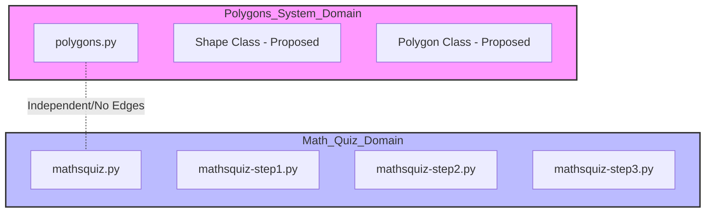
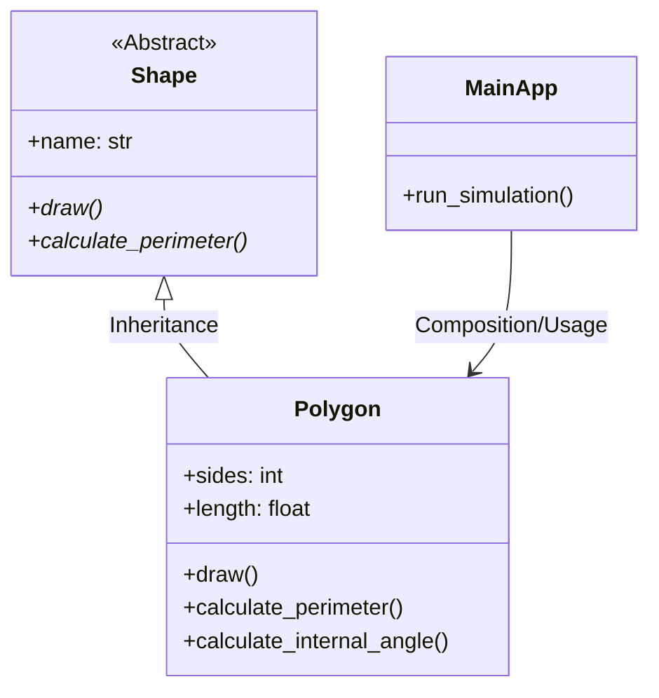

# Sequential Debugging Orchestration Plan: LangGraph & Context Engineering

## 1. Project Goals
The primary objective is to execute a full-system repair of the **Broken Python** repository while maintaining strict token efficiency. By utilizing a sequential, graph-driven approach, we isolate the contexts of the **Polygons System** and the **Math Quiz System**, eliminating the "Lost in the Middle" problem.

## 2. Architectural Visualizations (Reverse Engineering)

### System Domain Isolation
This diagram illustrates the separation of the two unrelated communities as identified in the dependency graph.



### Refactored OOP Schema (Target Architecture)
The refactored Polygons system transitions from procedural logic to a clean inheritance-based structure.



## 3. Architectural Decision Records (ADR)

### ADR 001: Choice of Orchestration Framework
*   **Decision:** Use **LangGraph** instead of CrewAI or AutoGen.
*   **Context:** The project requires deterministic control over the state and context window to meet the >70% token efficiency KPI.
*   **Rationale:** 
    *   **Surgical State Control:** LangGraph allows for explicit manipulation of the `AgentState`, enabling the implementation of "Gatekeeper" nodes.
    *   **Context Compaction:** Unlike autonomous agent swarms (CrewAI), LangGraph nodes can be programmed to perform a hard reset of the message history between phases.
    *   **Mitigating "Lost in the Middle":** By clearing the context window before transitioning from Polygons to Math Quiz, we ensure the LLM focus remains 100% on the current task.

## 4. Recommended Repository Structure
```text
C:\Users\diana\hw_4\
├── docs/               # PRD, PLAN, and ADR documentation
├── obsidian/           # Graphify products and navigation context (hot_*.md)
├── src/                # Refactored source code
│   ├── polygons/       # Isolated Polygons domain
│   └── mathsquiz/      # Isolated Math Quiz domain
├── tests/              # TDD-based unit tests (85% coverage target)
│   ├── test_polygons.py
│   └── test_mathsquiz.py
├── reports/            # Linter (Ruff) and Token Efficiency reports
└── main.py             # System entry point
```

## 5. Agent Workflow Implementation
1.  **Master Router:** Reads `index.md` and initializes the `AgentState`.
2.  **Subagent Alpha (Polygons):** Ingests `hot_polygons.md`, refactors code, and updates the local graph.
3.  **The Gatekeeper:** Intercepts the state, logs completion, and **purges the message history**.
4.  **Subagent Beta (Math Quiz):** Ingests `hot_mathsquiz.md` with a clean context and consolidates the quiz engine.
