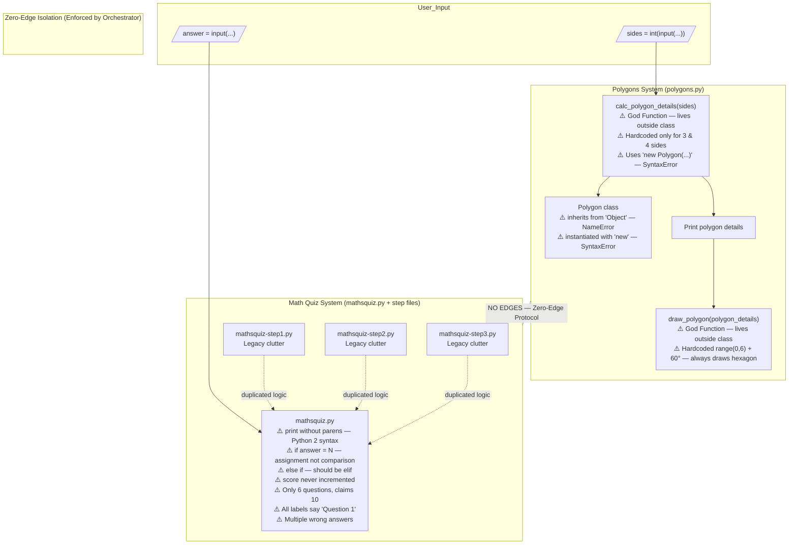

# Architectural Block Schema — Before State

This diagram shows the actual (before-state) architecture of the `broken-python` repository as extracted by Graphify. Both systems are procedural, isolated from each other, and each has distinct structural problems.

## Key Observations

- **God Nodes:** `calc_polygon_details()` and `draw_polygon()` live outside the `Polygon` class, violating encapsulation entirely.
- **No shared state:** The two systems (`polygons/` and `mathsquiz/`) are fully independent — no shared imports, no shared utilities.
- **Fragmented Math Quiz:** The step files (`step1`–`step3`) duplicate logic from `mathsquiz.py` and pollute the namespace without adding value.
- **Entry points:** Both systems use top-level scripting (no `if __name__ == "__main__"` guard), making them untestable as-is.
