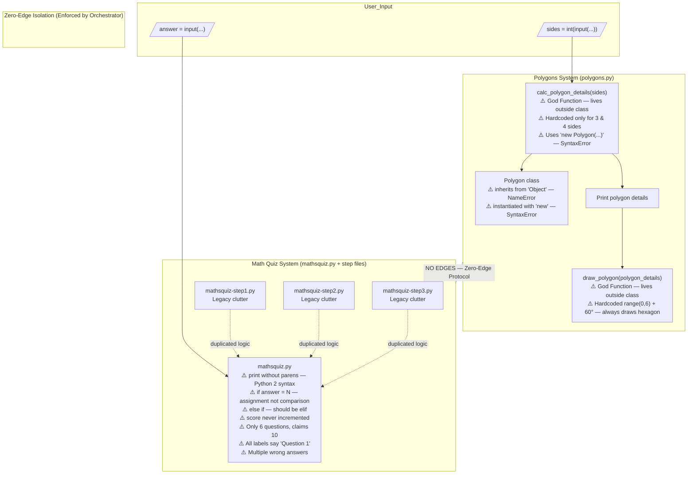
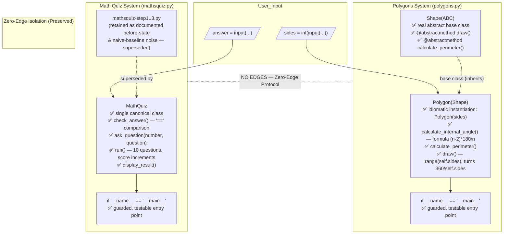

# Architectural Block Schema — Before & After

## Before State (Broken)

This diagram shows the actual (before-state) architecture of the `broken-python` repository as extracted by Graphify. Both systems are procedural, isolated from each other, and each has distinct structural problems.

### Key Observations

- **God Nodes:** `calc_polygon_details()` and `draw_polygon()` live outside the `Polygon` class, violating encapsulation entirely.
- **No shared state:** The two systems (`polygons/` and `mathsquiz/`) are fully independent — no shared imports, no shared utilities.
- **Fragmented Math Quiz:** The step files (`step1`–`step3`) duplicate logic from `mathsquiz.py` and pollute the namespace without adding value.
- **Entry points:** Both systems use top-level scripting (no `if __name__ == "__main__"` guard), making them untestable as-is.

## After State (Refactored)

This diagram shows the architecture after remediation, as captured in the after-state graph (`docs/after_state/`). The God Functions are gone, behaviour is encapsulated behind a real abstraction (`Shape` → `Polygon`), and the Math Quiz logic is consolidated into a single canonical class. The Zero-Edge isolation between the two communities is preserved — the fix never coupled them.

### Key Improvements

- **God Nodes eliminated:** `calc_polygon_details()` and `draw_polygon()` are gone; their behaviour now lives as methods on `Polygon`, restoring encapsulation.
- **Real abstraction introduced:** a new `Shape(ABC)` base declares `draw()` / `calculate_perimeter()`; `Polygon(Shape)` is the first concrete subclass — the new bridge that did not exist before.
- **Math Quiz consolidated:** all quiz logic collapses into one `MathQuiz` class. The `step1`–`step3` files are intentionally **retained** (not deleted) as the documented before-state and as the naive baseline's "noise" for the token-efficiency proof.
- **Entry points guarded:** both modules now run only under `if __name__ == "__main__"`, making them importable and testable.
- **Isolation preserved:** the two communities still share zero edges — the refactor improved each system internally without coupling them.
- **Graph delta:** these changes correspond to the **27 → 35 node** growth between [`before_state`](before_state/graph.html) and [`after_state`](after_state/graph.html) (`Polygon` 4 → 8 edges, new `Shape` hub at 6 edges). See [`knowledge_delta.md`](../obsidian/knowledge_delta.md).
