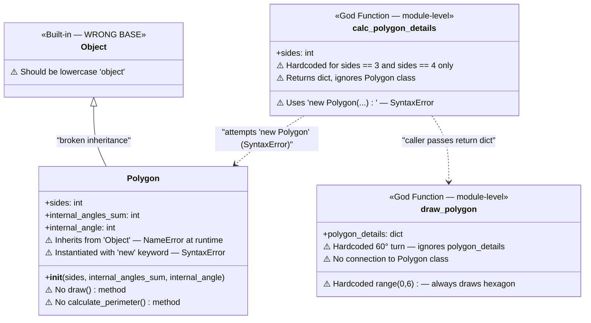
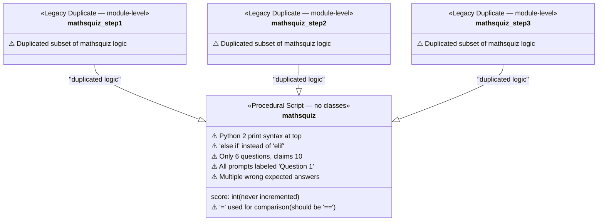
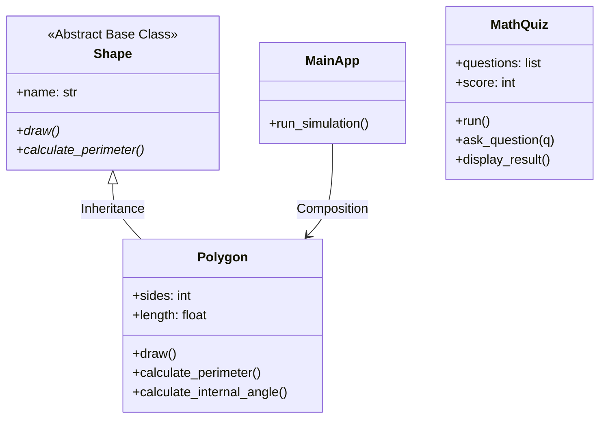

# OOP Schema — Before State

This diagram represents the actual object-oriented (or lack thereof) structure of the `broken-python` codebase **before remediation**, as reverse-engineered from the source files.

## Polygons System — Before State

## Math Quiz System — Before State

## Target Architecture — After Remediation

